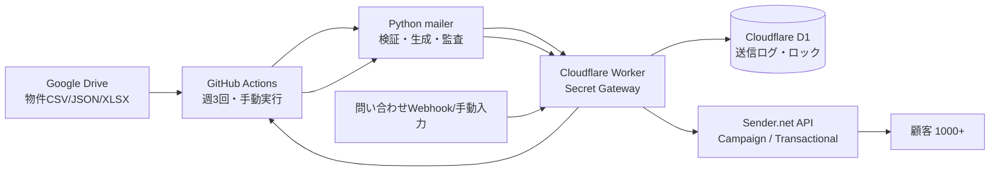

<!-- AI_README_SETUP_GUIDE_START -->
## 🧭 画像付き初期設定ガイド


このリポジトリ **real-estate-sender-automation** を初めて開いた人は、まずここだけ見れば初期設定から実行、成果物確認まで進められます。

### 最初にやること

1. 必要なSecretや外部サービス設定を確認します。
2. GitHub Actions または README の実行手順に沿って動かします。
3. 実行ログと成果物を確認します。
4. エラー時は Actions の失敗ステップと Secret名を確認します。

### 詳しい画像付きガイド

- [docs/setup-visual-guide.md](docs/setup-visual-guide.md)
- [docs/image-generation-prompts.md](docs/image-generation-prompts.md)

> SecretやAPIキーの実値は、README、Issue、ログ、画像に絶対に貼らないでください。例では `********` または `YOUR_SECRET_HERE` を使います。

<!-- AI_README_SETUP_GUIDE_END -->


# Real Estate Sender Automation

Google Drive上の物件データを取り込み、配信前に自動ダブルチェックを行い、Sender.netで週3回の物件案内メールを配信するための運用基盤です。問い合わせが来た場合は、物件資料URL付きのTransactionalメールを自動返信できます。

SecretをGitHubに置きすぎない設計です。Sender API Tokenなどの高権限SecretはCloudflare WorkerのSecretとして保存し、GitHub ActionsはCloudflare Workerを安全に呼び出します。

## できること

- Google DriveまたはローカルCSV/JSON/XLSXから物件データを取得
- 物件データのスキーマ検証、価格・面積・URL・公開状態チェック
- HTML/TXTメール生成後の二重チェック
- Cloudflare D1による送信済み物件の重複防止
- Cloudflare D1によるジョブロックで二重起動を防止
- Sender APIによるキャンペーン作成、予約送信、即時送信
- Sender Transactional APIによる問い合わせ返信
- GitHub Actionsの週3回スケジュールと手動実行
- Cloudflare Worker CronからGitHub Actionsを発火する冗長構成
- CI、テスト、README、運用ドキュメント、Mermaid構成図

## アーキテクチャ概要



## 重要

チャットに貼られたCloudflare/SenderのAPIキーは露出済みとして扱い、実運用前にローテーションしてください。このリポジトリには実値を保存していません。

## 初期セットアップ

詳細は `docs/setup.md` を確認してください。

```bash
python -m venv .venv
source .venv/bin/activate
pip install -r requirements.txt
python -m property_mailer run-daily --dry-run
```
