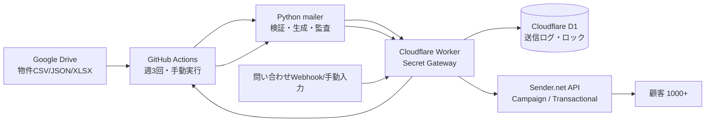

# Real Estate Sender Automation

Google Drive上の物件データを取り込み、配信前に自動ダブルチェックを行い、Sender.netで週3回の物件案内メールを配信するための運用基盤です。問い合わせが来た場合は、物件資料URL付きのTransactionalメールを自動返信できます。

このリポジトリは、SecretをGitHubに置きすぎない設計にしています。Sender API Tokenなどの高権限SecretはCloudflare WorkerのSecretとして保存し、GitHub ActionsはCloudflare Workerを安全に呼び出します。

## できること

- Google DriveまたはローカルCSV/JSON/XLSXから物件データを取得
- 物件データのスキーマ検証、価格・面積・URL・公開状態チェック
- HTML/TXTメール生成後の二重チェック
- Cloudflare D1による送信済み物件の重複防止
- Cloudflare D1によるジョブロックで二重起動を防止
- Sender APIによるキャンペーン作成、予約送信、即時送信
- Sender Transactional APIによる問い合わせ返信
- GitHub Actionsの週3回スケジュールと手動実行
- Cloudflare Worker CronからGitHub Actionsを発火する冗長構成
- CI、テスト、README、運用ドキュメント、Mermaid構成図

## アーキテクチャ概要



## 推奨運用

1. Sender側で送信ドメインを認証し、SPF/DKIM/DMARCを設定します。
2. Cloudflare Workerに `SENDER_API_TOKEN`、`WORKER_SHARED_SECRET`、必要に応じて `GITHUB_TOKEN` をSecretとして保存します。
3. Cloudflare D1を作成し、Workerにバインドします。
4. GitHub Actionsには、Workerを呼ぶための最小Secretだけを保存します。
5. `property-mailer.yml` が月・水・金の朝に実行されます。Sender側の予約送信APIが使える場合はSender予約を使い、GitHub Actionsは作成・予約・監査ログ保存を担当します。

## 重要: すでに共有されたAPIキーについて

チャットに貼られたCloudflare/SenderのAPIキーは、第三者に見えた可能性がある前提でローテーションしてください。このリポジトリには実値を保存していません。実運用では新しいキーを発行し、Cloudflare WorkerのSecretとして登録してください。

## 初期セットアップ

詳細は [`docs/setup.md`](docs/setup.md) を見てください。

最小構成の流れ:

```bash
python -m venv .venv
source .venv/bin/activate
pip install -r requirements.txt
python -m property_mailer run-daily --dry-run
```

Cloudflare Worker:

```bash
cd worker
npm install
npx wrangler d1 create property-mailer-db
# wrangler.toml の database_id を更新
npx wrangler d1 migrations apply property-mailer-db --remote
npx wrangler secret put SENDER_API_TOKEN
npx wrangler secret put WORKER_SHARED_SECRET
npx wrangler deploy
```

## 主要Secret名

| 保存先 | Secret名 | 用途 |
|---|---|---|
| Cloudflare Worker | `SENDER_API_TOKEN` | Sender API呼び出し |
| Cloudflare Worker | `WORKER_SHARED_SECRET` | GitHub ActionsからWorkerを呼ぶBearer Secret |
| Cloudflare Worker | `GITHUB_TOKEN` | WorkerからGitHub Actionsを発火する場合 |
| GitHub Actions | `AUTOMATION_WORKER_URL` | Worker URL |
| GitHub Actions | `WORKER_SHARED_SECRET` | Worker認証用。Cloudflare側と同じ値 |
| GitHub Actions | `GOOGLE_SERVICE_ACCOUNT_JSON` | Google Drive読み取り用サービスアカウントJSON |

## GitHub Actions

- `.github/workflows/ci.yml`: Pythonテスト、ruff、Worker TypeScript typecheck
- `.github/workflows/property-mailer.yml`: 週3回の物件メール配信、手動実行、問い合わせ返信
- `.github/workflows/cloudflare-deploy.yml`: Cloudflare Workerの手動デプロイ

## データ形式

物件データはCSV/JSON/XLSXをサポートします。最低限の列は以下です。

- `property_id`
- `title`
- `price`
- `area`
- `address`
- `status`
- `updated_at`
- `detail_url`
- `brochure_url`

サンプルは [`data/sample_properties.csv`](data/sample_properties.csv) を参照してください。

## 運用者向けガイド

- 日々の使い方: [`docs/operator-guide.md`](docs/operator-guide.md)
- セキュリティ: [`docs/security.md`](docs/security.md)
- アーキテクチャ: [`docs/architecture.md`](docs/architecture.md)
- データ仕様: [`docs/data-schema.md`](docs/data-schema.md)
