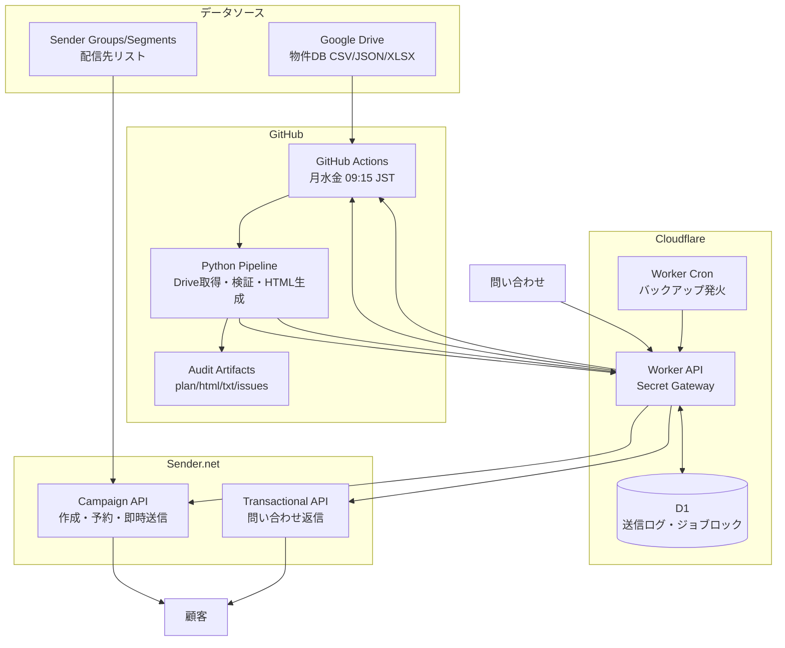
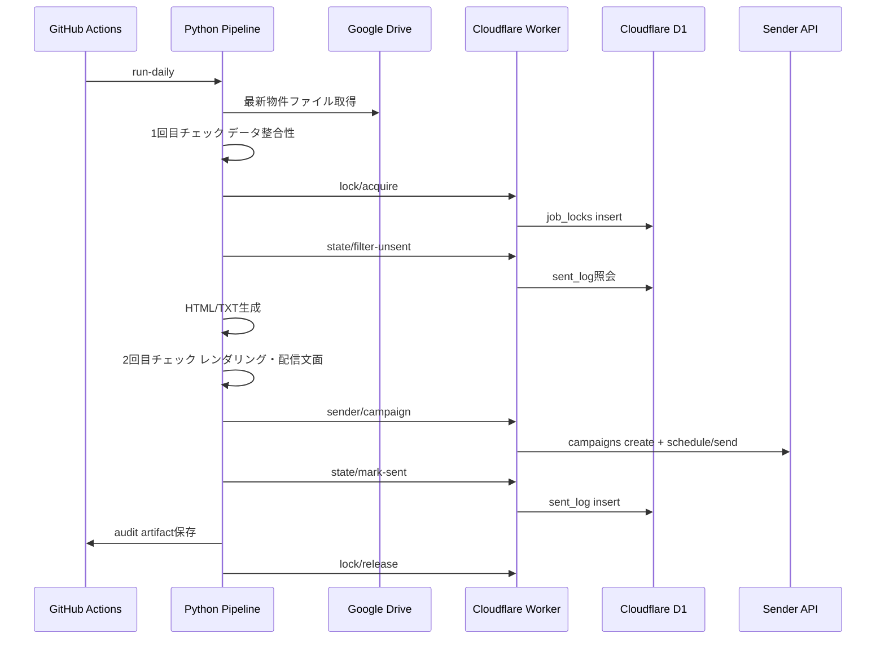
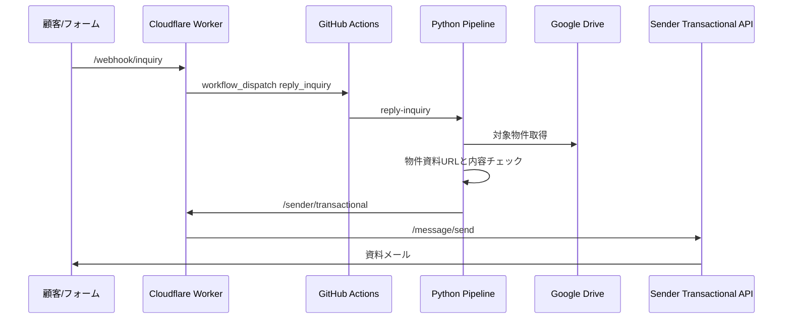
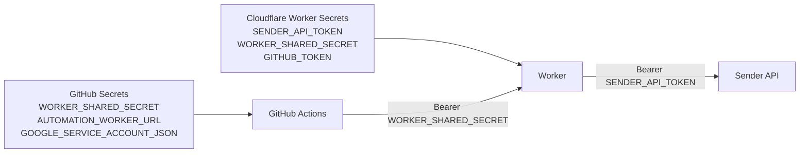

# アーキテクチャ

## 目的

1000人以上の顧客に週3回、最新の不動産物件情報を安定して配信します。配信前に自動ダブルチェックを行い、誤配信・重複配信・Secret漏洩を防ぎます。

## 全体像

## なぜCloudflare D1を使うか

GitHub Actionsのスケジュール実行は便利ですが、実行環境は毎回作り直されます。送信済みログやジョブロックをローカルSQLiteだけに置くと、次回実行時に重複判定が不安定になります。そのため、本番ではCloudflare D1に以下を保存します。

- `sent_log`: audienceと物件fingerprintの組み合わせを一意に保存
- `job_locks`: 二重起動防止
- `webhook_events`: 問い合わせWebhookの監査ログ

## 配信フロー

## 問い合わせ返信フロー

## Secret設計

Sender API TokenはCloudflare Workerだけに保存するのが推奨です。GitHub ActionsにはWorker呼び出し用の共有Secretだけを置きます。

## 失敗時の考え方

- Worker認証失敗: `WORKER_SHARED_SECRET` の不一致
- Sender 401/403: Cloudflare側 `SENDER_API_TOKEN` の期限切れ・権限不足
- Drive取得失敗: Googleサービスアカウントの共有権限不足
- 重複送信の疑い: D1の `sent_log` を確認
- 二重起動: D1の `job_locks` とGitHub Actionsの `concurrency` を確認
